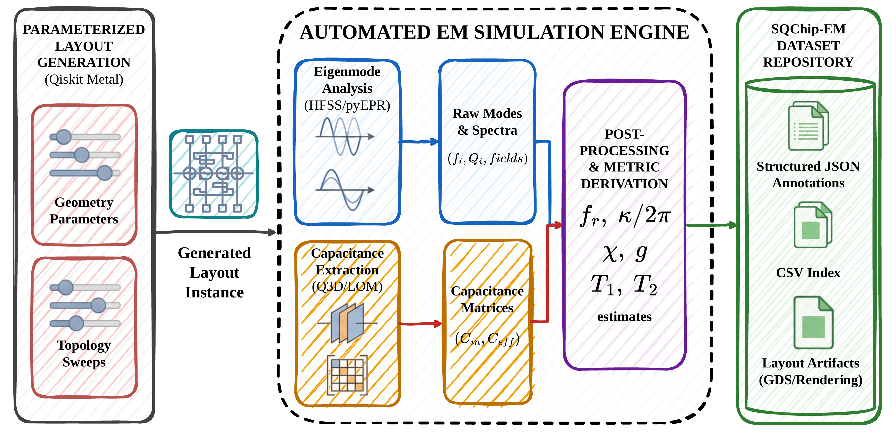
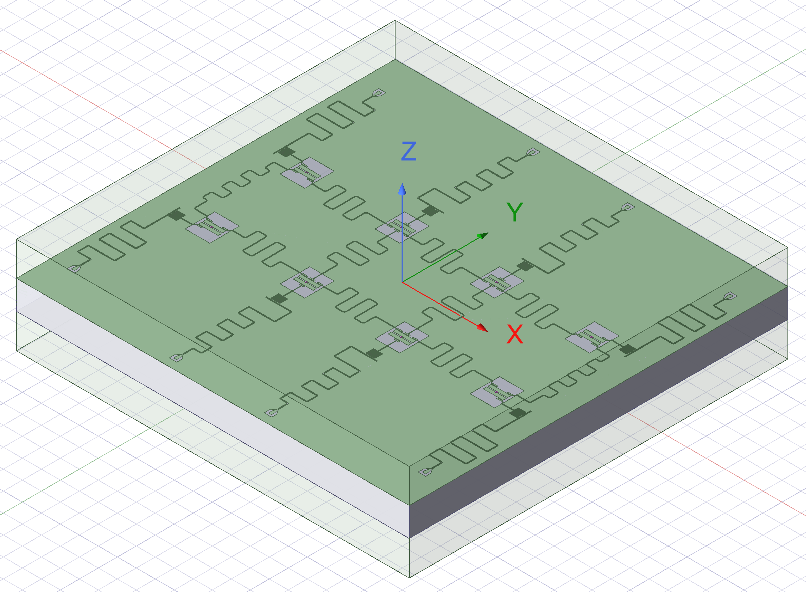
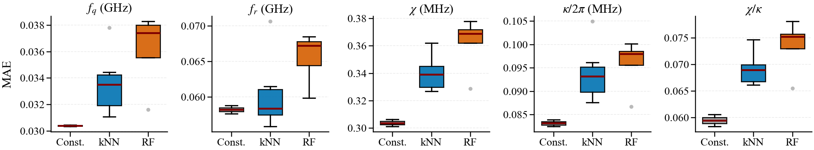
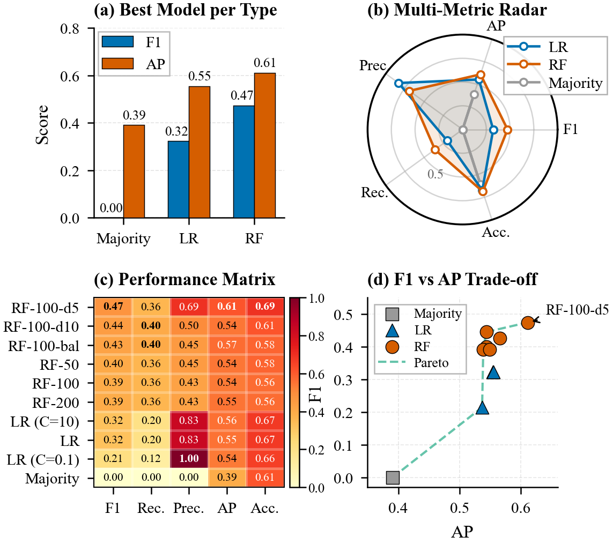
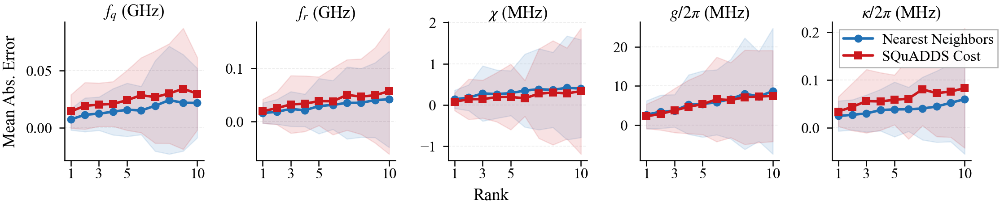
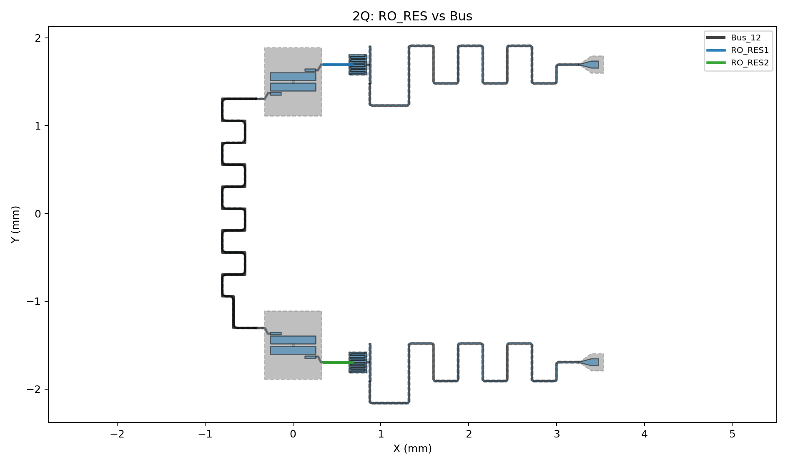
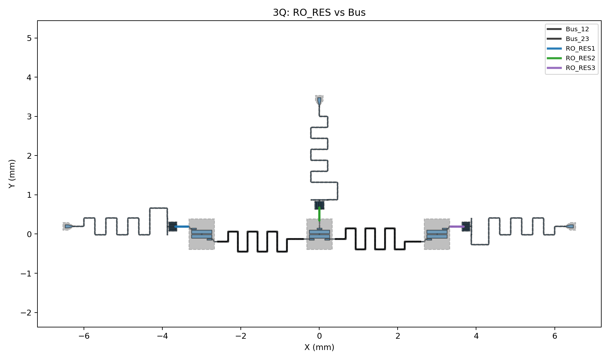
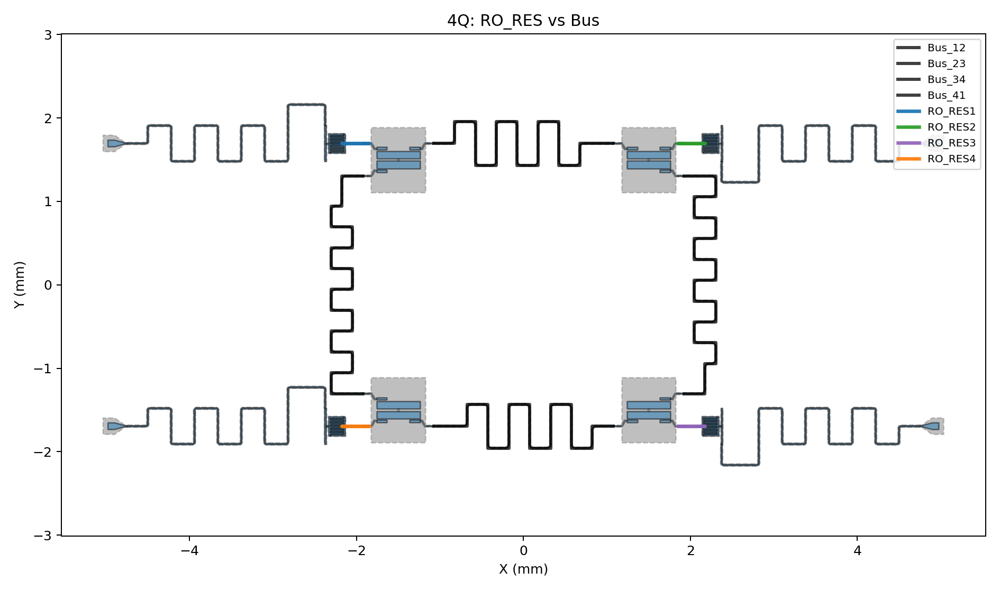
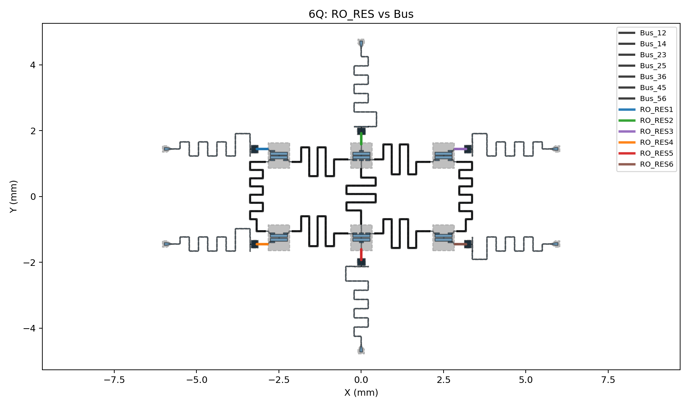
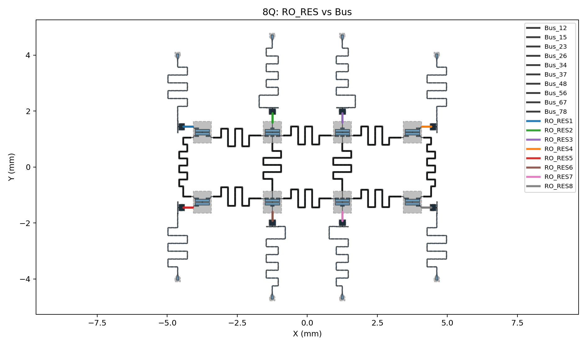

[](https://doi.org/10.5281/zenodo.20489133)

# SQChip-EM

**SQChip-EM** is a Qiskit-Metal-based layout-to-electromagnetic simulation dataset for superconducting quantum chips.

It links parameterized superconducting chip layouts to generated GDSII artifacts, structured JSON annotations, CSV indices, and benchmark outputs for machine-learning-assisted quantum electronic design automation.



The figure below shows the superconducting chip layout used in the paper.



SQChip-EM is organized around three principles:

1. **Layout-grounded records** rather than abstract circuit-only specifications
2. **Electromagnetic evidence** through GDSII layouts, HFSS/Q3D-derived annotations, and postprocessed chip metrics
3. **Reusable benchmark protocols** for regression, feasibility classification, and inverse design retrieval

---

## What SQChip-EM Contains

SQChip-EM is a dataset and benchmark repository with four layers:

- **Parameterized layout generators**: Qiskit Metal scripts for 1- to 8-qubit superconducting chip layouts
- **Dataset artifacts**: CSV indices, structured JSON annotations, and GDSII layout files
- **Benchmark baselines**: reusable regression, classification, and retrieval baseline implementations
- **Reported results**: benchmark predictions, metrics, feature importances, and figures used for analysis

This checkout includes public data for 1-qubit and 2-qubit records. Dataset folders are also prepared for 3-, 4-, 6-, and 8-qubit records so the remaining SQChip-EM data can be copied into the same schema.

---

## Why SQChip-EM

Superconducting quantum chip performance depends strongly on layout geometry and electromagnetic environment. Abstract circuit datasets often hide effects such as:

- readout and qubit mode shifts
- dispersive coupling changes
- parasitic capacitance and port loading
- frequency crowding across multi-device layouts
- Purcell-filter and external-coupling tradeoffs

SQChip-EM preserves layout-to-EM traceability so downstream methods can be evaluated against simulation-level physical evidence instead of simplified proxy parameters.

---

## Repository Layout

```text
SQChip-EM/
|-- README.md
|-- CITATION.cff
|-- requirements.txt
|-- chip_code/
|   |-- metal_KDD.py
|   |-- metal_KDD_1qubit.py
|   |-- metal_KDD_2qubit.py
|   `-- metal_KDD_{3,4,5,6,8}qubit.py
|-- data/
|   |-- sqchip_em_1q/
|   |   |-- summary.csv
|   |   |-- json/
|   |   `-- gds/
|   |-- sqchip_em_2q/
|   |   |-- summary.csv
|   |   |-- json/
|   |   `-- gds/
|   |-- sqchip_em_3q/
|   |   |-- .gitkeep
|   |   |-- json/
|   |   `-- gds/
|   |-- sqchip_em_4q/
|   |   |-- .gitkeep
|   |   |-- json/
|   |   `-- gds/
|   |-- sqchip_em_6q/
|   |   |-- .gitkeep
|   |   |-- json/
|   |   `-- gds/
|   `-- sqchip_em_8q/
|       |-- .gitkeep
|       |-- json/
|       `-- gds/
|-- task1_baseline/
|-- task1_result/
|-- task2_baseline/
|-- task2_result/
|-- task3_baseline/
|-- task3_result/
|-- examples/
|   `-- poor_2q/
|       |-- json/
|       |-- gds/
|       `-- metadata/
|-- figure/
`-- scripts/
    `-- validate_repository.py
```

For this local checkout, `sqchip_em_3q`, `sqchip_em_4q`, `sqchip_em_6q`, and `sqchip_em_8q` are prepared with tracked placeholder directories. Their `summary.csv`, JSON files, and GDS files should follow the schema below when the corresponding data is added.

---

## Dataset Format

Each dataset split uses the same layout:

- `summary.csv`: lightweight dataset-wide index for filtering and ML input/output construction
- `json/`: structured per-sample annotations with layout parameters, simulation metadata, EM-derived metrics, qubit/readout summaries, and artifact references
- `gds/`: layout artifacts preserving geometry and topology

Additional low-quality or failed 2-qubit chip candidates are stored separately under `examples/poor_2q/`. They are not part of the curated SQChip-EM benchmark split, but are retained as reference examples for debugging, filtering, and negative-case inspection. The `metadata/` folder keeps the associated sweep manifests, baseline metrics, and preview images.

Core 1-qubit summary fields include:

```text
sample_id, dx_mm, dy_mm, Lj_nH, Cj_fF, tee_finger_length_um,
tee_finger_count, tee_cap_gap_um, ro_L_mm, fq_GHz, fr_GHz,
Delta_GHz, g_over_2pi_MHz, chi_MHz, kappa_over_2pi_MHz,
chi_over_kappa, Cin_fF, Ceff_fF, status
```

Core 2-qubit summary fields include:

```text
sample_id, q1_x_mm, q1_y_mm, q2_x_mm, q2_y_mm,
Lj1_nH, Cj1_fF, Lj2_nH, Cj2_fF,
fq1_GHz, fr1_GHz, Delta1_GHz, g1_over_2pi_MHz,
chi1_MHz, kappa1_over_2pi_MHz, chi1_over_kappa1,
fq2_GHz, fr2_GHz, Delta2_GHz, g2_over_2pi_MHz,
chi2_MHz, kappa2_over_2pi_MHz, chi2_over_kappa2,
chi12_MHz, T1_qubit1_est_us, T2_qubit1_est_us,
T1_qubit2_est_us, T2_qubit2_est_us, status, error, warnings1, warnings2
```

The 3-, 4-, 6-, and 8-qubit splits follow the 2-qubit convention, extended by qubit index. For an N-qubit split such as `sqchip_em_3q`, `sqchip_em_4q`, `sqchip_em_6q`, or `sqchip_em_8q`, the expected `summary.csv` pattern is:

```text
sample_id,
q1_x_mm, q1_y_mm, ..., qN_x_mm, qN_y_mm,
Lj1_nH, Cj1_fF, ..., LjN_nH, CjN_fF,
fq1_GHz, fr1_GHz, Delta1_GHz, g1_over_2pi_MHz,
chi1_MHz, kappa1_over_2pi_MHz, chi1_over_kappa1,
...
fqN_GHz, frN_GHz, DeltaN_GHz, gN_over_2pi_MHz,
chiN_MHz, kappaN_over_2pi_MHz, chiN_over_kappaN,
chi12_MHz, chi13_MHz, ..., chi{N-1}{N}_MHz,
T1_qubit1_est_us, T2_qubit1_est_us, ..., T1_qubitN_est_us, T2_qubitN_est_us,
status, error, warnings1, ..., warningsN
```

The per-sample JSON files mirror the same indexing style:

```text
meta.sample_id
meta.layout.positions_mm.Q1 ... QN
meta.layout.junctions.Lj1_nH ... LjN_nH
qubits.Q1 ... QN
resonators.readout1 ... readoutN
chip.T1_qubit1_est_us ... chip.T1_qubitN_est_us
chip.chi12_MHz, chip.chi13_MHz, ..., chip.chi{N-1}{N}_MHz
```

---

## Benchmarks

SQChip-EM includes three illustrative task families from the paper.

### Task 1: Design-to-Metric Regression

Predict chip metrics such as `fq_GHz`, `fr_GHz`, `chi_MHz`, `kappa_over_2pi_MHz`, and `chi_over_kappa` from design parameters.

Baselines:

- constant mean/median
- k-nearest neighbors
- random forest regressor



### Task 2: Specification Feasibility Classification

Classify whether a design satisfies target feasibility criteria such as dispersive-shift thresholds.

Baselines:

- majority classifier
- logistic regression
- random forest classifier



### Task 3: Inverse Design Retrieval

Retrieve candidate layouts from target EM specifications.

Baselines:

- nearest-neighbor retrieval
- SQuADDS-style weighted cost retrieval
- surrogate-model-based retrieval



---

## Layout Examples

The repository includes rendered layout examples for several chip scales.








---

## Installation

Create a Python environment and install the lightweight analysis dependencies:

```bash
pip install -r requirements.txt
```

The benchmark baselines require only NumPy, pandas, and scikit-learn. Regenerating chip layouts and EM simulations additionally requires a working Qiskit Metal + Ansys HFSS/Q3D environment, which is platform-specific and not installed by `requirements.txt`.

---

## Quickstart

Validate the repository structure and public data files:

```bash
python scripts/validate_repository.py
```

Load the 1-qubit CSV index:

```python
import pandas as pd

df = pd.read_csv("data/sqchip_em_1q/summary.csv")
print(df[["sample_id", "fq_GHz", "fr_GHz", "chi_MHz"]].head())
```

Use a baseline model:

```python
import pandas as pd
from task1_baseline import RandomForestBaseline

df = pd.read_csv("data/sqchip_em_1q/summary.csv").dropna()
features = ["dx_mm", "dy_mm", "Lj_nH", "Cj_fF", "tee_finger_length_um", "tee_finger_count", "tee_cap_gap_um", "ro_L_mm"]
target = "fq_GHz"

model = RandomForestBaseline(n_estimators=100, random_state=42)
model.fit(df[features], df[target])
pred = model.predict(df[features].head())
print(pred)
```

---

## Reproducibility Notes

- CSV indices are intended as the primary lightweight entry points.
- JSON files retain richer per-sample metadata and derived EM quantities.
- GDSII files provide geometry traceability.
- Some raw simulation logs and intermediate sweep artifacts are retained for provenance.
- Full EM regeneration depends on local Ansys/Qiskit Metal setup, solver versions, and license availability.

---

## Citation

If you use SQChip-EM, please cite:

```bibtex
@inproceedings{peng2026sqchipem,
  title     = {SQChip-EM: A Qiskit-Metal-Based Layout-to-EM Simulation Dataset for Superconducting Quantum Chips},
  author    = {Peng, Yu and Chen, Junyu and Chen, Yuhan and Zhang, Shenglong and Li, Xingdong and Li, Tingting and Zhao, Ziming and Yin, Jianwei},
  booktitle = {Proceedings of the 32nd ACM SIGKDD Conference on Knowledge Discovery and Data Mining V.2},
  year      = {2026},
  publisher = {ACM},
  doi       = {10.1145/3770855.3817558}
}
```
